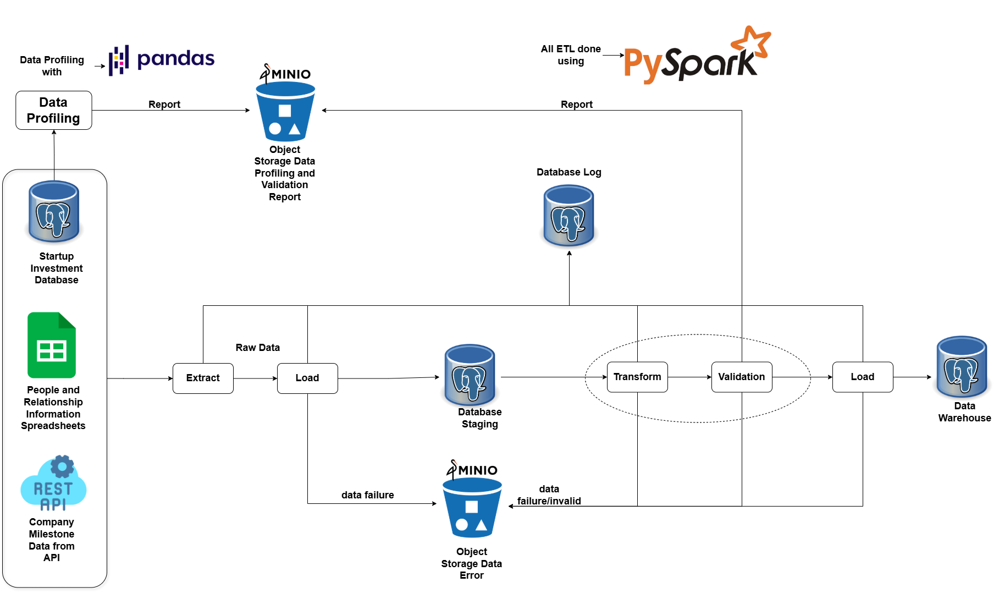

# Proyek Data Pipeline: Startup Ecosystem Analytics

Sebuah data pipeline end-to-end untuk mengintegrasikan, memproses, dan menganalisis data ekosistem startup dari berbagai sumber. Proyek ini dibuat memungkinkan analisis mendalam terhadap tren investasi, kinerja perusahaan, dan jaringan para pemain kunci.

## Daftar Isi
- [Proyek Data Pipeline: Startup Ecosystem Analytics](#proyek-data-pipeline-startup-ecosystem-analytics)
  - [Daftar Isi](#daftar-isi)
  - [Requirements Gathering \& Solution](#requirements-gathering--solution)
    - [Latar Belakang Masalah (Background Problem)](#latar-belakang-masalah-background-problem)
      - [1. Ketidakmampuan Mengevaluasi Momentum Pertumbuhan Secara Akurat](#1-ketidakmampuan-mengevaluasi-momentum-pertumbuhan-secara-akurat)
      - [2. Analisis Strategi *Exit* yang Terfragmentasi](#2-analisis-strategi-exit-yang-terfragmentasi)
      - [3. Keterbatasan dalam Pemetaan Jaringan Modal Manusia](#3-keterbatasan-dalam-pemetaan-jaringan-modal-manusia)
    - [Solusi yang Diusulkan (Proposed Solution)](#solusi-yang-diusulkan-proposed-solution)
    - [Profiling Data](#profiling-data)
    - [Desain Arsitektur Pipeline](#desain-arsitektur-pipeline)
  - [Desain Target Database (Data Warehouse)](#desain-target-database-data-warehouse)
    - [🧭 Proses Bisnis 1: Evaluasi Perjalanan Pendanaan dan Pertumbuhan Startup](#-proses-bisnis-1-evaluasi-perjalanan-pendanaan-dan-pertumbuhan-startup)
      - [Tabel Fakta:](#tabel-fakta)
      - [Tabel Dimensi:](#tabel-dimensi)
    - [🚀 Proses Bisnis 2: Analisis Strategi Exit dan Kinerja Pasar Startup](#-proses-bisnis-2-analisis-strategi-exit-dan-kinerja-pasar-startup)
      - [Tabel Fakta:](#tabel-fakta-1)
      - [Tabel Dimensi:](#tabel-dimensi-1)
    - [🌐 Proses Bisnis 3: Pemetaan Ekosistem dan Jaringan Penggerak Startup](#-proses-bisnis-3-pemetaan-ekosistem-dan-jaringan-penggerak-startup)
      - [Tabel Fakta:](#tabel-fakta-2)
      - [Tabel Dimensi:](#tabel-dimensi-2)
    - [🧾 Ringkasan Final Desain Data Warehouse](#-ringkasan-final-desain-data-warehouse)
      - [✅ Tabel Dimensi (Memberikan Konteks "Siapa, Apa, Di Mana, Kapan")](#-tabel-dimensi-memberikan-konteks-siapa-apa-di-mana-kapan)
      - [📊 Tabel Fakta (Perekam Peristiwa \& Ukuran Bisnis)](#-tabel-fakta-perekam-peristiwa--ukuran-bisnis)
  - [Desain Alur Kerja ETL](#desain-alur-kerja-etl)
    - [Staging Layer](#staging-layer)
    - [Warehouse Layer](#warehouse-layer)
  - [Teknologi yang Digunakan](#teknologi-yang-digunakan)
  - [Cara Menjalankan Pipeline](#cara-menjalankan-pipeline)
  - [Hasil yang Diharapkan dari Setiap Analisis](#hasil-yang-diharapkan-dari-setiap-analisis)

## Requirements Gathering & Solution

### Latar Belakang Masalah (Background Problem)
Perusahaan **"VenturePulse"** adalah perusahaan konsultan investasi yang mempunyai klien dari berbagai perusahaan startup hingga institusi keuangan. Dalam menjalankan misinya, VenturePulse menghadapi kendala utama dalam mengintegrasikan dan menganalisis informasi dan data dari berbagai sumber secara menyeluruh. Informasi dan penjelasan mengenai berbagai data tersebut bisa dilihat di [dataset-doc.md](dataset-doc.md). Keterbatasan dan kerumitan akses terhadap data yang tersebar di berbagai format dan sumber tersebut menyebabkan beberapa masalah bisnis sebagai berikut:

#### 1. Ketidakmampuan Mengevaluasi Momentum Pertumbuhan Secara Akurat

- **Kondisi:** Data pendanaan (`funding_rounds`, `investments`, `funds`) dan pencapaian (`milestones`) tersedia dari berbagai sumber, namun belum dihubungkan secara eksplisit dalam model analitik.
- **Masalah:** Sulit untuk menilai dampak langsung dari pendanaan terhadap pertumbuhan startup. Pertanyaan seperti “apakah pendanaan Seri B mendorong peluncuran produk utama?” tidak dapat dijawab secara langsung karena tidak adanya keterkaitan yang jelas antara waktu, sumber dana, dan pencapaian bisnis.

**Tabel kunci:**
- `funding_rounds`, `investments`, `funds`, `milestones`

---

#### 2. Analisis Strategi *Exit* yang Terfragmentasi

- **Kondisi:** Data akuisisi (`acquisitions`) dan IPO (`ipos`) tersedia dalam database, namun belum dilengkapi dengan atribut deskriptif perusahaan atau waktu yang mendetail untuk mendukung analisis longitudinal dan sektoral.
- **Masalah:** Tanpa model data yang terstruktur untuk membandingkan aktivitas dan nilai exit, sulit melakukan analisis perbandingan antar industri, waktu, atau jenis strategi exit. Pertanyaan seperti “berapa rata-rata valuasi IPO di sektor fintech dalam 5 tahun terakhir” atau “korporasi mana yang paling sering mengakuisisi startup” tidak bisa dijawab secara efisien.

**Tabel kunci:**
- `acquisitions`, `ipos`,  `ipos`

---

#### 3. Keterbatasan dalam Pemetaan Jaringan Modal Manusia

- **Kondisi:** Data `relationships` yang menghubungkan individu ke perusahaan tersedia, dan pencapaian perusahaan (`milestones`) juga tersedia, namun belum terintegrasi dalam satu model analitik untuk pelacakan karier dan inovasi.
- **Masalah:** Sulit melacak jejak kontribusi individu terhadap pertumbuhan dan inovasi lintas perusahaan. Visualisasi jaringan atau analisis dampak modal manusia terhadap performa startup tidak dapat dilakukan secara utuh karena keterbatasan keterkaitan antara individu, peran, dan hasil nyata yang dicapai.

**Tabel kunci:**
- `relationships`, `milestones`, `people`, `company`


### Solusi yang Diusulkan (Proposed Solution)

Oleh karena itu perlu dibangun **Data Pipeline Terpusat** yang mengotomatisasi proses pengumpulan, pembersihan, transformasi, dan pemuatan data dari berbagai sumber ke dalam sebuah **Data Warehouse** tunggal.

Tujuannya adalah menyediakan data yang andal, terintegrasi, dan siap pakai untuk analisis strategis tanpa intervensi manual berlebihan.

### Profiling Data

Proses profiling data membantu mengidentifikasi masalah kualitas data yang spesifik. Temuan ini menjadi dasar penting dalam menentukan langkah-langkah transformasi pada proses ETL, karena langsung memengaruhi keakuratan dan kelengkapan analisis bisnis yang akan dilakukan.

**1. Kelengkapan Data (Completeness) yang Rendah pada Metrik Kunci**

Banyak kolom krusial untuk analisis bisnis memiliki persentase *missing values* yang sangat tinggi. Hal ini secara langsung menghambat proses bisnis yang telah didefinisikan:

* **Dampak pada Analisis Pendanaan & Exit:**
    * Pada tabel `funding_rounds`, data valuasi sangat tidak lengkap, dengan **48.1%** nilai hilang pada `pre_money_currency_code` dan **41.63%** pada `post_money_currency_code`.
    * Pada tabel `acquisitions`, **81.67%** data `term_code` (tipe akuisisi: cash/stock) hilang.
    * **Implikasi:** Tanpa data ini, **mustahil** untuk mengevaluasi kinerja pendanaan atau menganalisis strategi *exit* secara komprehensif. Proses ETL harus menerapkan strategi untuk menangani nilai-nilai yang hilang ini sebelum memuatnya ke `fact_investment_round_participation` dan `fact_acquisitions`. 
      * Pada tabel `funding_rounds`, kolom  `post_money_currency_code` dan `pre_money_currency_code` akan kita drop karena kolom `pre_money_valuation_usd` dan kolom `post_money_valuation_usd` datanya tidak kosong dan sudah dalam usd sehingga tidak perlukan lagi kedua kolom mata tersebut.
      * Pada tabel `acquisitions` kolom `term_code` akan diisi `Unknown` untuk data yang hilang

* **Dampak pada Pemetaan Jaringan & Karier:**
    * Tabel `relationship` memiliki data tanggal yang sangat minim: `start_at` hilang **53.48%** dan `end_at` hilang **85.71%**.
    * **Implikasi:** Ini secara fundamental merusak kemampuan untuk "Memetakan Jaringan Modal Manusia". Analisis durasi karier atau periode aktif seseorang di sebuah perusahaan menjadi tidak akurat. Transformasi pada `fact_relationship` harus mampu menangani tanggal yang kosong ini.
      * Oleh karena itu kita akan mengisi kedua kolom ini dengan tanggal jauh di masa depan (2100-01-01) untuk menandakan tanggal ini kosong. Sehingga bisa difilter saat analisis nantinya.

* **Dampak pada Analisis Geografis:**
    * Informasi lokasi pada tabel `company` juga tidak lengkap, seperti `state_code` (**42.36%** hilang) dan `city` (**4.59%** hilang).
    * **Implikasi:** Analisis berbasis lokasi menjadi kurang andal. Kolom-kolom ini perlu dibersihkan sebelum dimuat ke `dim_company`.

**2. Integritas dan Format Data yang Belum Standar**

* **Tipe Data Tanggal:** Sebagian besar kolom tanggal di berbagai tabel (`funding_rounds.funded_at`, `acquisitions.acquired_at`, `relationship.start_at`) ditemukan sebagai tipe data `object` (string), bukan `datetime`.
* **Implikasi:** Ini menyebabkan semua bentuk analisis berbasis waktu (tren, durasi, dsb.) terhambat. Oleh karena itu semua kolom tanggal harus dikonversi ke format `YYYYMMDD` sebagai *foreign key* ke `dim_date`.

### Desain Arsitektur Pipeline

Pipeline terdiri dari beberapa komponen utama:

- **Layers:**
  - **Data Sources:** PostgreSQL, file CSV/JSON, dan API eksternal.
  - **Staging Layer:** Menyimpan data mentah di PostgreSQL schema `staging` untuk proses transformasi lebih lanjut.
  - **Warehouse Layer:** Menyimpan data terstruktur yang sudah ditransformasi dalam schema `warehouse` berbasis Star Schema.

- **Logging & Monitoring:**
  - Informasi setiap proses etl setiap tabel akan disimpan di tabel database `log` tabel `etl_log`.

- **Validation & Error Handling:**
  - Setiap proses yang error datanya akan disimpan di **minio**. Report hasil hasil validasi juga disimpan di **Minio**.



## Desain Target Database (Data Warehouse)

Struktur data warehouse dirancang berdasarkan prinsip **Kimball** menggunakan pendekatan **Star Schema**. Model ini menjadikan **tabel fakta** sebagai pusat penyimpanan peristiwa bisnis yang terukur, dikelilingi oleh **tabel dimensi** yang memberikan konteks ("siapa", "apa", "kapan", "di mana").

---

### 🧭 Proses Bisnis 1: Evaluasi Perjalanan Pendanaan dan Pertumbuhan Startup

Fokus: Mengukur aliran modal, momentum pertumbuhan, dan jaringan pendanaan startup.

#### Tabel Fakta:
- **`fact_investment_round_participation`**
  - **Grain:** Satu baris mewakili satu partisipasi unik perusahaan investor dalam satu putaran pendanaan.
  - **Peran:** Tabel paling krusial untuk analisis pendanaan. Tabel ini memungkinkan analisis jaringan co-investor dan menjawab pertanyaan seperti "siapa berinvestasi bersama siapa?"

- **`fact_funds`**
  - **Grain:** Satu baris per peristiwa penerimaan dana non-formal oleh sebuah perusahaan.
  - **Peran:** Melengkapi total modal yang diterima perusahaan di luar funding round formal.

- **`fact_milestones`**
  - **Grain:** Satu baris per pencapaian milestone spesifik.
  - **Peran:** Memberikan konteks kualitatif terhadap angka pendanaan dan menjawab "mengapa" perusahaan dianggap layak menerima investasi.

#### Tabel Dimensi:
- **`dim_company`**
  - **Peran:** Dimensi konform yang mewakili perusahaan, berperan ganda sebagai investee dan investor.
  - **Grain:** Satu baris per perusahaan.

- **`dim_date`**
  - **Peran:** memberikan kerangka waktu untuk seluruh analisis tren pendanaan.
  - **Grain:** Satu baris per hari kalender.

---

### 🚀 Proses Bisnis 2: Analisis Strategi Exit dan Kinerja Pasar Startup

Fokus: Menganalisis peristiwa puncak seperti akuisisi dan IPO dalam siklus hidup startup.

#### Tabel Fakta:
- **`fact_acquisitions`**
  - **Grain:** Satu baris per peristiwa akuisisi.
  - **Peran:** Merekam volume dan nilai M&A sebagai indikator likuiditas pasar startup.

- **`fact_ipos`**
  - **Grain:** Satu baris per peristiwa IPO.
  - **Peran:** Mengukur jalur exit alternatif melalui pasar publik dan memungkinkan perbandingan antar strategi exit.

#### Tabel Dimensi:
- **`dim_company`**
  - **Peran:** Memainkan banyak peran sebagai pengakuisisi, yang diakuisisi, dan perusahaan yang IPO.
  - **Grain:** Satu baris per perusahaan.

- **`dim_date`**
  - **Peran:** Memungkinkan analisis tren exit dari waktu ke waktu.
  - **Grain:** Satu baris per hari.

---

### 🌐 Proses Bisnis 3: Pemetaan Ekosistem dan Jaringan Penggerak Startup

Fokus: Memetakan kontribusi individu dan relasi dalam pertumbuhan ekosistem startup.

#### Tabel Fakta:
- **`fact_person_company_relationship`**
  - **Grain:** Satu baris per hubungan kerja spesifik antara seorang individu dan perusahaan.
  - **Peran:** Sumber utama pemetaan modal manusia, sangat penting untuk pelacakan karier dan analisis jaringan profesional.

- **`fact_milestones`**
  - **Grain:** Satu baris per peristiwa milestone spesifik.
  - **Peran:** Memetakan hasil kerja dan bukti inovasi individu/perusahaan. Dapat digunakan untuk mengidentifikasi wilayah dengan frekuensi inovasi tinggi.

#### Tabel Dimensi:
- **`dim_people`**
  - **Peran:** Subjek utama dari pemetaan individu dan karier.
  - **Grain:** Satu baris per individu unik.

- **`dim_company`**
  - **Peran:** memberikan konteks lokasi organisasi atau perusahaan dan hubungan profesional.
  - **Grain:** Satu baris per perusahaan.

- **`dim_date`**
  - **Peran:** Menyediakan kerangka temporal untuk aktivitas profesional.
  - **Grain:** Satu baris per hari kalender.

---

### 🧾 Ringkasan Final Desain Data Warehouse

#### ✅ Tabel Dimensi (Memberikan Konteks "Siapa, Apa, Di Mana, Kapan")
| Nama Tabel    | Peran                                           | Grain                    |
|---------------|--------------------------------------------------|--------------------------|
| `dim_date`    | Waktu standar untuk seluruh peristiwa            | Satu baris per hari      |
| `dim_company` | Representasi unik perusahaan & lokasi            | Satu baris per perusahaan|
| `dim_people`  | Representasi unik individu (talenta/startup actor)| Satu baris per individu  |

#### 📊 Tabel Fakta (Perekam Peristiwa & Ukuran Bisnis)
| Nama Tabel                          | Peran                                                                 | Grain                                             |
|------------------------------------|------------------------------------------------------------------------|---------------------------------------------------|
| `fact_investment_round_participation` | Partisipasi investor dalam putaran pendanaan                            | Per partisipasi investor per putaran              |
| `fact_funds`                       | Dana yang diterima di luar funding round formal                         | Per peristiwa penerimaan dana                     |
| `fact_acquisitions`               | Akuisisi startup                                                       | Per peristiwa akuisisi                            |
| `fact_ipos`                       | IPO startup                                                           | Per peristiwa IPO                                 |
| `fact_milestones`                | Pencapaian penting/inovasi startup (Factless Fact Table)              | Per milestone                                     |
| `fact_relationship`              | Relasi kerja antara individu dan perusahaan (Factless Fact Table)     | Per hubungan kerja                                |

---

Pemetaan source-to-target disediakan dalam dokumen terpisah ya [source_to_target_mapping](source_to_target_mapping.md)

## Desain Alur Kerja ETL

### Staging Layer
1. **Extract:** PySpark menarik data dari berbagai sumber (API, database source dan spreadsheet).
2. **Load:** Data yang sudah ditarik dari berbagai sumber oleh Pyspark kemudian akan disimpan ke **Database Staging** PostgreSQL.  

### Warehouse Layer
1. **Extract:** Data raw yang sudah disimpan di *Database Staging** kemudian diextract lagi oleh pyspark untuk proses transformasi. 
  
2. **Transform:** 
Data yang sudah diextract kemudian akan dilakukan :
   - Pembersihan data (null, duplikat)
   - Standarisasi format
   - Enrichment kolom
   - Integrasi tabel berdasarkan `object_id`

3. **Validation:** Data hasil transformasi kemudian divalidasi dan report hasil validasinya disimpan pada **Data Storage Minio**.  

4. **Load:** Data hasil transformasi dimuat ke warehouse secara *incremental* (insert/update).

Jika salah satu proses gagal maka data yang gagal diproses akan disimpan di **Minio**. Setiap proses ETL pada setiap tabel, informasi lognya akan disimpan pada **Database Log**

## Teknologi yang Digunakan

- **Bahasa:** Python
- **Engine Pemrosesan:** Apache Spark (via PySpark)
- **Penyimpanan:**
  - PostgreSQL (Staging & Warehouse)
  - Minio (data profiling dan data hasil validasi)
- **Containerization:** Docker, Docker Compose

## Cara Menjalankan Pipeline

1. **Prasyarat:**
   - Docker & Docker Compose

2. **Clone Repo:**
   ```bash
   git clone https://github.com/oscar-sinaga/data_pipeline_pyspark.git
   cd data_pipeline_pyspark
3. **Create env.file di project repo:**
   ```bash
    # DB Source
    DB_HOST_STARTUP_INVESTMENTS=source_db
    DB_USER=postgres
    DB_PORT=5432
    DB_PASS=cobapassword
    DB_NAME_STARTUP_INVESTMENTS=startup_investments
    CRED_PATH=configs/creds/opportune-mile-415309-a66de863c40a.json
    KEY_SPREADSHEET_PEOPLE=1GrGl6WkBhdTvGJ_o3wtGNRqvpFx7Dpxr9v53NbxCbDc
    KEY_SPREADSHEET_RELATIONSHIPS=12krNH752qF-S5ByaAgA30p3KyCgGPWo7EivN46odUDU

    # DB Pipeline
    DB_HOST_PIPELINE=pipeline_db
    DB_NAME_LOG=etl_log
    DB_NAME_STG=staging
    DB_NAME_WH=warehouse
    DB_PORT_STG=5432
    DB_PORT_LOG=5432
    DB_PORT_WH=5432

    # MinIO Config
    MINIO_HOST=minio
    MINIO_PORT=9000
    MINIO_CONSOLE_PORT=9001
    MINIO_ROOT_USER=oscar
    MINIO_ROOT_PASSWORD=oscar123
    ACCESS_KEY_MINIO=URsIRcb2pvvQEoDolq8t
    SECRET_KEY_MINIO=eI1OBPEATrapvpn2g22ra16qX4hjBr31UURdbtEr
    PROFILING_BUCKET_NAME=profiling-startup-investments
    ERROR_STAGING_SI_BUCKET_NAME=error-startup-investments
    ```

4. **Create Minio and Spredsheet Credentials**

    Terlebih dahulu buat credentials untuk minio dan dan credentials untuk akses ke spreadsheetnya. Disini file `data\source\people.csv` dan `data\source\relationships.csv` perlu di upload ke gdrive dijadikan spreadsheet  dan akses ke api spreadsheetnya akan diambil berdasarkan credentials yang digenerate oleh **Google Data Cloud Servive**.

5. **Save the credentials**
  ```bash
    # Buat folder creds
    mkdir data/creds
  ```
  Simpan credentials di folder `data/creds`

6.  **Membangun dan Menjalankan Services**:
    
    Jalankan perintah berikut untuk membangun image dan menjalankan semua service (Spark, PostgreSQL, Minio) di background:
    ```bash
    docker-compose up -d --build
    ```
7.  **Memicu ETL Job**:
    
    Untuk menjalankan pipeline, eksekusi skrip Spark menggunakan `spark-submit` di dalam container `spark-master`:

    ```bash
    docker exec -it spark-master bash scripts/start.sh
    ```

## Hasil yang Diharapkan dari Setiap Analisis

Setelah pipeline berjalan dan data warehouse terisi, tim analis VenturePulse akan mampu menjawab pertanyaan-pertanyaan strategis dengan cepat:

* **Untuk Evaluasi Pendanaan & Pertumbuhan:**
    * Membuat dashboard interaktif yang menampilkan tren pendanaan (QoQ, YoY) berdasarkan sektor dan geografi.
    * Menganalisis korelasi langsung antara peristiwa pendanaan dengan peluncuran produk atau *milestone* penting lainnya.

* **Untuk Analisis Strategi Exit:**
    * Menghasilkan laporan yang membandingkan valuasi dan frekuensi IPO vs. Akuisisi di berbagai industri.
    * Mengidentifikasi profil pendiri atau karakteristik perusahaan yang paling sering berujung pada *exit* yang sukses.

* **Untuk Pemetaan Ekosistem:**
    * Membuat visualisasi jaringan yang memetakan hubungan "investor-perusahaan-pendiri".
    * Mengidentifikasi pemain kunci dan "super-connectors" dalam ekosistem startup.